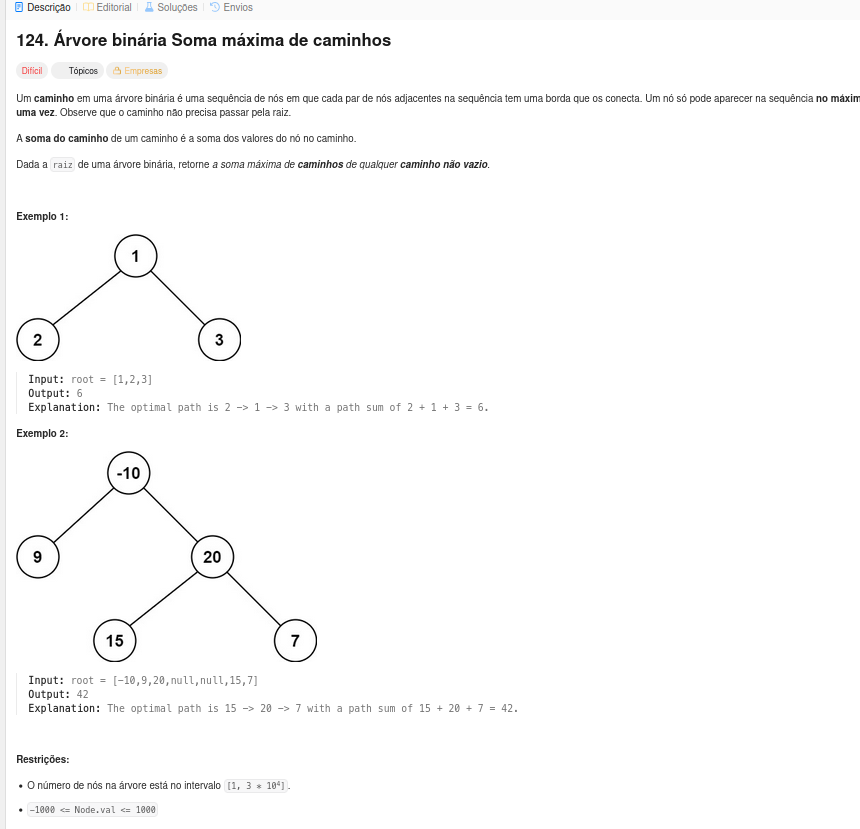
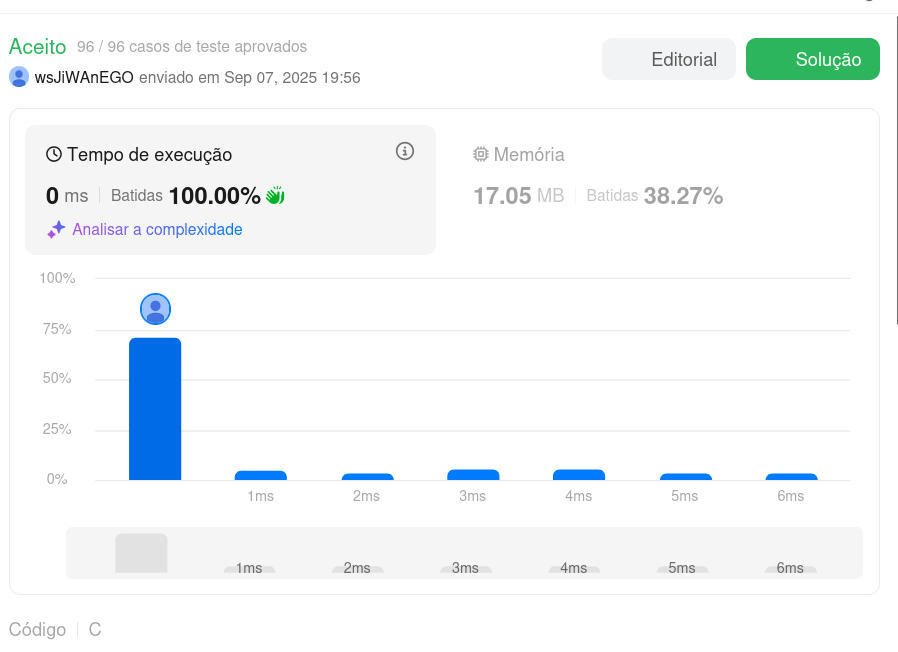
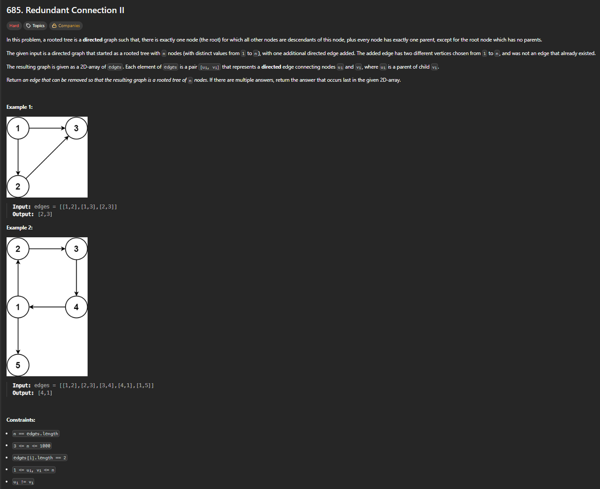
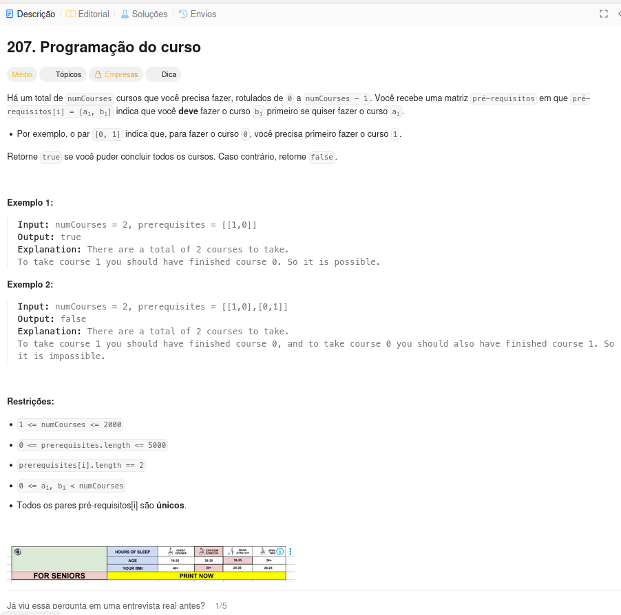

# Exercícios sobre Grafos 1

**Conteúdo da Disciplina**: Grafos 1 

## Alunos

|Matrícula | Aluno |
| -- | -- |
| 20/2023663 | Gabriel Basto Bertolazi |
| 20/2017503 | Wildemberg Sales da Silva Junior |

## Sobre

Esse exercício visa buscar a resolução dos exercícios escolhidos pela plataforma do LeetCode, com o objetivo de mostrar nossos conhecimentos aprendidos no conteúdo de grafos 1. Neles vamos aplicar conceitos e conhecimentos de lógica aprendidos na matéria de Projeto de Algoritmos com o professor Maurício Serrano.

Principais funcionalidades:
- Descobrir o maior caminho dentro de uma árvore.
- Identificar a existências de ciclos e pais duplicados para um mesmo nó em um grafo direcionado.
- Identificação de ciclos dentro de uma implementação de uma matriz de adjacência.

## Screenshots

### Visualização de Grafo → Execução de Algoritmo →  Resultado de Caminho Mínimo

#### Questão 1   

#### Questão 1 no LeetCode  

---

#### Questão 2   

**Explicação da Resolução:** Foi utilizado dois vetores auxiliares para marcação de quem são filhos e quem são pais dentro das arestas passadas, com isso seria possível verificar se algum filho estava apontando para algum pai (Ciclo) ou se algum filho estava recebendo um segundo pai (Quebra da árvore).

---

#### Questão 3   

**Explicação da Resolução:** Para esta questão foi utilizado uma lógica de matriz de adjacencia que guardava todas as dependências fornecidas. Com isso foi desenvolvido um modelo de DFS para percorrer a matriz com ajuda de um vetor de visitados, para analisar se em algum momento as dependências de cursos criavam um ciclo.

---

## Instalação

sudo apt update && sudo apt install -y build-essential

## Uso

gcc questao_x.c -o questao_x && ./questao_x

## Apresentação

Vídeo disponível em: [youtube](https://youtu.be/K3ExD20ChGY)

## Outros

Para dúvidas, sugestões ou melhorias, entre em contato com os autores.
